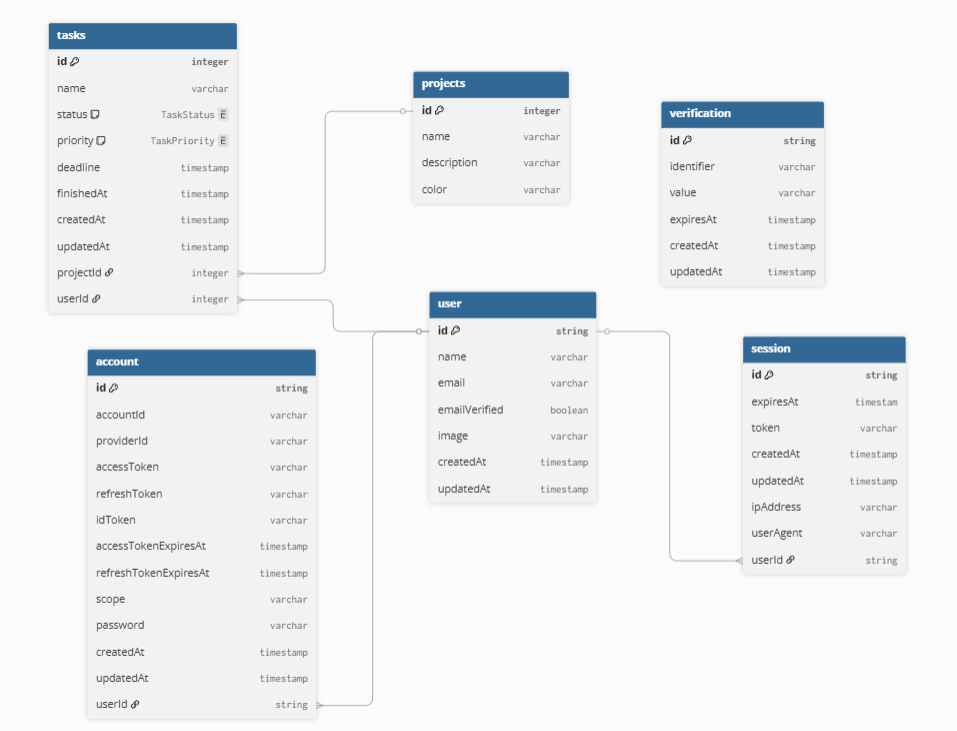

# Backend — Documentación

API REST construida con **Elysia.js** sobre Node.js, con tipado estricto de extremo a extremo y documentación OpenAPI generada automáticamente.

## Stack

| Capa          | Tecnología                       |
| ------------- | -------------------------------- |
| Framework     | Elysia.js (adapter Node)         |
| Base de datos | PostgreSQL                       |
| ORM           | Prisma                           |
| Autenticación | Better Auth                      |
| Validación    | Zod + esquemas de `@repo/shared` |
| Logging       | Pino                             |
| Tests         | Vitest                           |

## Estructura

```
src/
├── modules/          # Dominio de la app, organizado por feature
│   ├── projects/
│   │   ├── project.routes.ts      # Definición de endpoints y validaciones
│   │   ├── project.services.ts    # Lógica de negocio
│   │   └── project.repository.ts  # Acceso a base de datos (Prisma)
│   ├── tasks/
│   └── user/
├── middlewares/      # Auth (Better Auth), error handler, request logger
├── lib/              # Instancias singleton: Prisma, auth, env, logger
├── common/           # Schemas compartidos (ej. param :id numérico)
├── constants/        # Tags OpenAPI
└── index.ts          # Punto de entrada, setup de la app
```

Cada módulo sigue la separación: **routes → services → repository**. Los controllers (routes) son delgados: extraen parámetros, llaman al servicio y devuelven la respuesta. La lógica de negocio vive en services; el acceso a datos, en repositories.

## Modelos de datos



Las tareas tienen `status` (`NEW | IN_PROGRESS | STOPPED | FINISHED`) y `priority` (`LOW | MEDIUM | HIGH`).

## Autenticación

Better Auth maneja el flujo completo (sesiones, cuentas, verificación). Se expone como un plugin de Elysia (`betterAuth`) que se aplica por módulo. Las rutas protegidas declaran `auth: true`, lo que inyecta `user` y `session` en el contexto del handler y devuelve `401` si no hay sesión válida.

La configuración de auth vive en `src/lib/auth.ts`. Sus endpoints están documentados por separado en `/api/v1/auth/openapi`.

## Validación y tipos

Los esquemas Zod del paquete `@repo/shared` se usan tanto para validar request bodies como para tipar las respuestas OpenAPI. Esto garantiza que frontend y backend comparten el mismo contrato de tipos sin duplicación.

Las variables de entorno también se validan con Zod al arrancar (`src/lib/env.ts`); si falta alguna, el proceso termina con un mensaje claro.

## Endpoints principales

| Método | Ruta                    | Descripción                               |
| ------ | ----------------------- | ----------------------------------------- |
| GET    | `/projects`             | Lista todos los proyectos                 |
| POST   | `/projects`             | Crea un proyecto                          |
| PATCH  | `/projects/:id`         | Actualiza un proyecto                     |
| DELETE | `/projects/:id`         | Elimina un proyecto (y sus tareas)        |
| GET    | `/tasks`                | Lista tareas (filtrable por query params) |
| GET    | `/tasks/:id`            | Obtiene una tarea                         |
| POST   | `/tasks`                | Crea una tarea                            |
| PATCH  | `/tasks/:id`            | Actualiza una tarea                       |
| DELETE | `/tasks/:id`            | Elimina una tarea                         |
| GET    | `/tasks/dashboard-data` | Datos agregados para el dashboard         |
| GET    | `/users/me`             | Perfil del usuario autenticado            |

Documentación interactiva disponible en:

- `/openapi` — endpoints generales
- `/api/v1/auth/openapi` — endpoints de autenticación

## Variables de entorno

| Variable             | Descripción                                  |
| -------------------- | -------------------------------------------- |
| `DATABASE_URL`       | URL de conexión a PostgreSQL                 |
| `BETTER_AUTH_SECRET` | Secreto para firmar sesiones                 |
| `BETTER_AUTH_URL`    | URL base del backend (usada por Better Auth) |
| `FRONT_URL`          | URL del frontend (para CORS)                 |
| `SEED_USER_PASSWORD` | Contraseña usada en el seed de desarrollo    |

## Decisiones de diseño y tradeoffs

### Better Auth sobre auth custom

Better Auth reduce drásticamente el tiempo de implementación para flujos estándar (sesiones, cuentas, verificación de email). El tradeoff es menor control sobre los detalles internos del flujo: la lógica de sesiones, rotación de tokens y estructura de tablas viene impuesta por la librería. Para un producto con requisitos de auth no convencionales (MFA propio, tokens con claims custom, integración con identity providers internos) esta elección se volvería un obstáculo. Para este caso, la velocidad de iteración justifica la pérdida de control.

### Sin Redis para caché de sesiones

Las sesiones se leen desde PostgreSQL en cada request. Introducir Redis agregaría una capa de infraestructura con su propio ciclo de vida, sincronización de invalidación y complejidad operativa. A la escala actual, el costo de esa complejidad supera ampliamente el beneficio. Si el volumen de requests hiciera que las lecturas de sesión se convirtieran en un cuello de botella medible, Redis sería la respuesta obvia — pero optimizar antes de tener ese problema es deuda de complejidad que no vale la pena cargar.

### Elysia sobre Express/Fastify

Elysia ofrece inferencia de tipos nativa en el contexto del handler (body, params, query, response) sin capas de generación de código. El ecosistema es menos maduro que Express o Fastify, lo que implica menos plugins disponibles y comunidad más pequeña. Se asumió ese riesgo a cambio de una experiencia de desarrollo más coherente y tipado más estricto desde el framework hacia afuera.

---

## Comandos útiles

```bash
# Desarrollo
pnpm dev

# Migraciones
pnpm prisma migrate dev

# Seed (datos de prueba)
pnpm prisma db seed

# Tests
pnpm test
```
