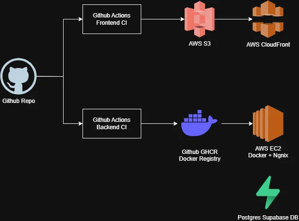

# Arquitectura y Despliegue - Flowboard



---

# Arquitectura de despliegue

## Frontend

El frontend se despliega utilizando:

- Amazon S3 para almacenamiento de archivos estáticos
- Amazon CloudFront como CDN y capa HTTPS
- Certificados SSL administrados por AWS ACM

Flujo:

```txt
Usuario
↓
CloudFront
↓
S3
```

El bucket S3 se mantiene privado y el acceso se realiza únicamente a través de CloudFront utilizando Origin Access Control (OAC).

---

## Backend

El backend se encuentra dockerizado y desplegado en una instancia EC2.

Se utiliza:

- Docker Compose para la ejecución del contenedor
- Nginx como reverse proxy
- Certbot para HTTPS

Flujo:

```txt
Usuario
↓
Nginx
↓
Container Docker
↓
Elysia API
↓
Supabase PostgreSQL
```

---

### Base de datos

- PostgreSQL (Supabase)

---

# CI/CD

## Backend

El backend utiliza GitHub Actions para:

- Build de la imagen Docker
- Publicación en GitHub Container Registry (GHCR)
- Deploy automático vía SSH a EC2

---

## Frontend

El frontend utiliza GitHub Actions para:

- Build del proyecto Vite
- Sincronización automática hacia S3
- Invalidación automática de caché en CloudFront

La autenticación con AWS se realiza mediante IAM Roles + GitHub OIDC, evitando el uso de Access Keys permanentes.

---

# Servicios AWS utilizados

- EC2
- S3
- CloudFront
- IAM
- ACM

---

# Resultado final

## Frontend

```txt
https://flowboard.andrescode.com
```

## Backend

```txt
https://flowboard-backend.andrescode.com
```
